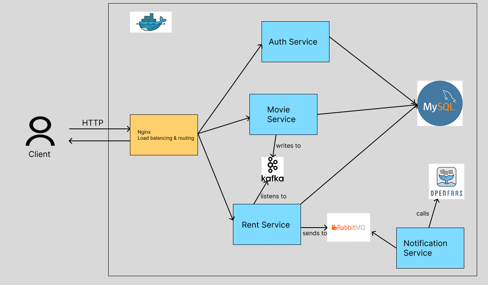

# Distributed movie rental system with microservices

---

## System Design



---

## Used tools

| Category | Tools |
|-----------|--------|
| Language | Go (Golang) |
| Database | MySQL 8 |
| Message Broker | RabbitMQ |
| Event Streaming | Kafka (Confluent) |
| Function-as-a-Service | OpenFaaS |
| Load Balancing | Nginx |
| Containerization | Docker & Docker Compose |
| Authentication | JWT |

---

## Microservices

### 1. Authentication Service

Handle user creation and login. Manages JWT tokens for authentication, and persists the users in `users` table.

### 2. Movie Service 

Does the CRUD operations for movies.
Publishes Kafka events whena movie is added or removed.
Rentals service consume its events.

### 3. Rental Service

Does the CRUD operations for rentals.
Consumes restaurant events from Kafka (to handle removals).
Produces rental notifications to RabbitMQ.

### 4. Notification Service

Consumes booking messages from RabbitMQ.
Invokes a local OpenFaaS function (`send-email`) via REST to simulate or send actual emails.

---

## Database Schema (mysql)

```sql
CREATE DATABASE IF NOT EXISTS microdb CHARACTER SET utf8mb4 COLLATE utf8mb4_unicode_ci;
USE microdb;

CREATE TABLE IF NOT EXISTS users(
    created_at TIMESTAMP DEFAULT CURRENT_TIMESTAMP,
    id BIGINT AUTO_INCREMENT PRIMARY KEY,
    username VARCHAR(100) not null unique,
    password_hash varchar(255) not null,
    email varchar(255)
);

CREATE TABLE IF NOT EXISTS movie(
    created_at TIMESTAMP DEFAULT CURRENT_TIMESTAMP,
    id BIGINT AUTO_INCREMENT PRIMARY KEY,
    name VARCHAR(255) not null,
    genre VARCHAR(255) not null,
    length_minutes int not null
);

CREATE TABLE IF NOT EXISTS rental(
    created_at TIMESTAMP DEFAULT CURRENT_TIMESTAMP,
    id BIGINT AUTO_INCREMENT PRIMARY KEY,
    username VARCHAR(100) not null,
    movie_id BIGINT not null,
    status ENUM('CONFIRMED', 'CANCELLED', 'EXPIRED') not null default 'CONFIRMED',
    expires_at TIMESTAMP AS (created_at + INTERVAL 48 HOUR) STORED,
    FOREIGN KEY (movie_id) REFERENCES movie(id) ON DELETE CASCADE 
);

CREATE TABLE IF NOT EXISTS movies_cache(
    id BIGINT PRIMARY KEY,
    name VARCHAR(255),
    genre VARCHAR(255),
    length_minutes int,
    last_seen TIMESTAMP DEFAULT CURRENT_TIMESTAMP
);
```

---

## Docker Compose

All components are containerized.
Each Go service includes a `depends_on` block to ensure database and brokers are ready before startup.